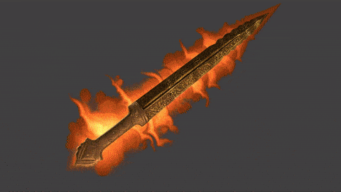

Stylized Sword Aura Effect with Shaders
=================

This repo contains code for a stylized aura effect on objects. The shader is well documented, so you should be able to follow along easily. Other than that I also did a detailed break dow 
of the enite technique in this blog post: https://medium.com/@shahriyarshahrabi/making-a-real-time-stylized-sword-aura-effect-with-shaders-7af5e89f8f65

